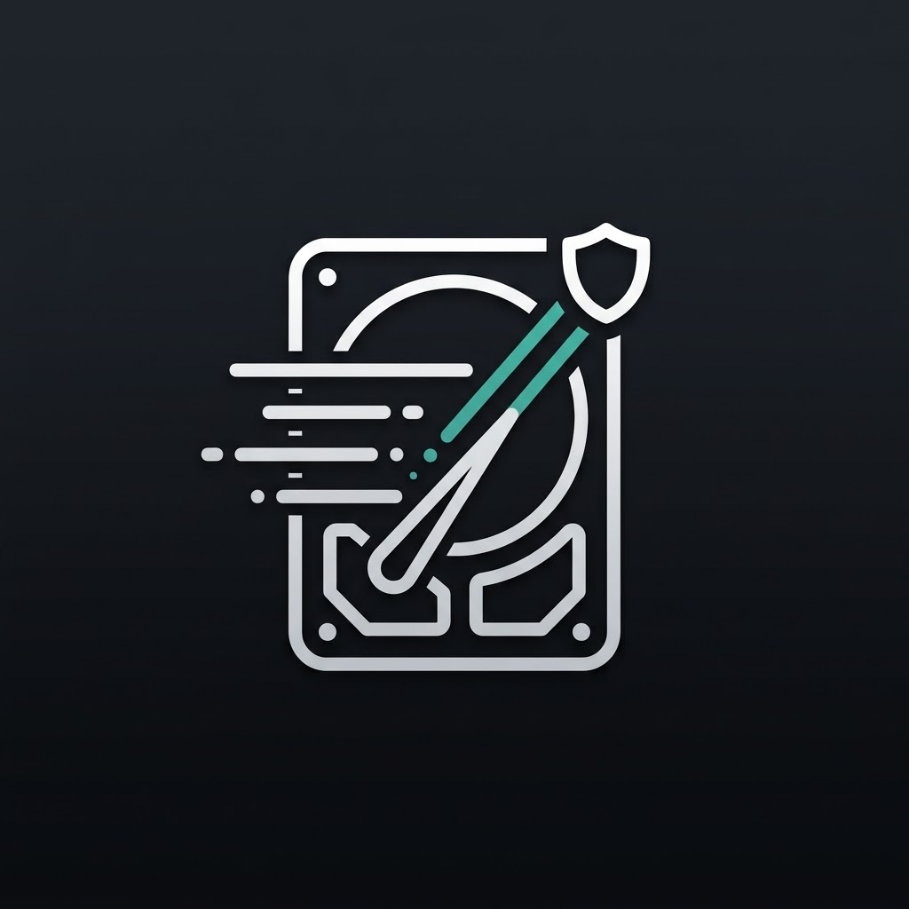

<div align="center">



# DiskCleaner for macOS

**輕量、安全、高效的 macOS 磁碟空間分析與清理工具**  
*A modern, safe, and powerful disk space analyzer & cleanup utility built natively for macOS.*

[](https://www.apple.com/macos/)
[](https://swift.org)
[](https://developer.apple.com/xcode/swiftui/)
[](https://developer.apple.com/documentation/swiftdata)
[](LICENSE)

</div>

---

## 📖 簡介 (Introduction)

**DiskCleaner** 是一款專為 macOS 使用者與開發者打造的本機磁碟空間管理工具。採用 Apple 原生 **SwiftUI** 與 **SwiftData** 開發，提供流暢直覺的操作體驗。

不論您是遭遇容量不足的 MacBook 使用者，還是累積了龐大快取的 iOS/Mac 開發者、設計師與影音工作者，DiskCleaner 能在幾秒內掃描磁碟、視覺化空間佔用，並提供智慧分類與一鍵安全清理建議。

---

## ✨ 核心特色 (Key Features)

### 📊 1. 空間總覽與健康度 (Storage Dashboard)
- **磁碟使用環形圖**：即時掌握 Macintosh HD 與外接硬碟的已用與剩餘空間。
- **容量嚴重不足警示**：低於 10% 可用容量時主動提示，避免影響虛擬記憶體與系統編譯。
- **智慧分類卡片**：一覽開發者暫存、套件快取、系統 Log 與大型檔案分布。

### 🗺️ 2. 空間地圖與 Treemap (Visual Space Explorer)
- **互動式矩形樹圖 (Treemap)**：以區塊大小直觀呈現資料夾佔用比率。
- **階層式檔案瀏覽器**：快速展開子資料夾、路徑導航，並支援一鍵在 Finder 中開啟定位。

### 🔨 3. 開發者深度快取清理 (Developer Mode)
針對 Xcode 與開發環境設計的專屬清理模組：
- **Xcode DerivedData**：專案編譯快取
- **Xcode Archives**：舊版打包封裝檔
- **iOS DeviceSupport**：舊版實體裝置除錯支援符號
- **套件快取**：CocoaPods、Swift Package Manager (SPM)、Carthage

### 📱 4. 模擬器瘦身 (Simulator Service)
- 整合 `xcrun simctl` 工具。
- 安全清除 CoreSimulator 暫存、未使用的 Simulator runtimes 與過期裝置。

### 🤖 5. AI 工具與套件暫存 (AI & Package Caches)
- 支援掃描清理 Hugging Face、Ollama 模型暫存與快取。
- 支援 Homebrew、npm、pip、Yarn 等常見套件管理工具快取。

### 📦 6. 大型檔案掃描 (Large Files Finder)
- 快速揪出大於指定門檻（如 500MB / 1GB+）的巨型影音檔、安裝映像檔（DMG/ISO）與封存壓縮檔（ZIP）。

### 🛡️ 7. 安全第一防護機制 (Safety & Privacy First)
- **垃圾桶優先（Trash First）**：清理預設移動至 macOS 垃圾桶，防止意外誤刪，隨時可復原。
- **系統關鍵目錄白名單保護**：嚴格鎖定 `/System`、`/usr`、`/bin`、`/sbin`、`/private` 等目錄，杜絕誤刪風險。
- **雙重確認機制**：執行前明確標示預估釋放容量與檔案清單。
- **零隱私上傳**：所有掃描與分析皆在本地端完成，不傳輸任何使用者檔案或隱私資訊。

### 📜 8. 清理歷史紀錄 (Audit History)
- 透過 **SwiftData** 持久化保存清理歷史（包含清理時間、釋放容量、項目數量）。

---

## 🛠️ 技術架構 (Technology Stack)

- **語言**：Swift 5.9+ / Swift 6
- **UI 框架**：SwiftUI (NavigationSplitView, Charts, Animation)
- **資料儲存**：SwiftData (`CleanupRecord`)
- **系統整合**：
  - `NSWorkspace` / `FileManager`（磁碟資訊與安全回收）
  - `simctl` CLI Wrapper（模擬器管理）
  - Apple HIG macOS AppIcon 規範（連續圓角與陰影）
- **相容版本**：macOS 14.0 (Sonoma) 或更高版本

---

## 📂 專案結構 (Project Structure)

```text
DiskCleaner/
├── DiskCleaner/
│   ├── DiskCleanerApp.swift          # App 進入點與 SwiftData ModelContainer 設定
│   ├── AppStore.swift                # 集中式應用程式狀態管理 (Store)
│   ├── ContentView.swift             # 主導航框架 (NavigationSplitView)
│   ├── CleanupRecord.swift           # SwiftData 歷史紀錄資料模型
│   ├── Core/                         # 核心邏輯
│   │   ├── DiskScanner.swift         # 磁碟與目錄遞迴掃描引擎
│   │   ├── RuleEngine.swift          # 基於 JSON 規則的候選檔案篩選引擎
│   │   ├── CleanupExecutor.swift     # 安全執行清理 (Trash/Permanent/Dry-Run)
│   │   ├── SimulatorService.swift    # Xcode 模擬器管理服務
│   │   ├── SystemServices.swift      # 磁碟空間取得與 Full Disk Access 偵測
│   │   ├── FileSystem.swift          # 檔案系統基本操作抽象
│   │   ├── Models.swift              # 空間節點、候選項目與類別資料結構
│   │   └── PathUtils.swift           # 路徑處理與大小格式化工具
│   ├── Views/                        # SwiftUI 視圖元件
│   │   ├── OverviewView.swift        # 儀表板總覽
│   │   ├── SpaceExplorerView.swift   # 空間地圖與階層式目錄樹
│   │   ├── TreemapView.swift         # 矩形樹圖視覺化
│   │   ├── CandidateListView.swift   # 待清理清單與分類明細
│   │   ├── LargeFilesView.swift      # 大型檔案搜尋器
│   │   ├── HistoryView.swift         # 清理歷史紀錄視圖
│   │   ├── CleanupSheets.swift       # 確認彈窗與進度條
│   │   └── Components.swift          # 共用 UI 元件（如 FDA Banner）
│   ├── Resources/
│   │   ├── rules.json                # 可擴充的快取與清理規則設定
│   │   └── AppIcon.icns              # 原生 macOS 圖示資源
│   └── Assets.xcassets/
│       ├── AppIcon.appiconset        # 16x16 ~ 1024x1024 完整解析度圖示
│       └── diskcleanerIcon.imageset  # 向量/點陣可引用圖檔
├── DiskCleanerTests/                 # 單元測試套件
└── diskcleanerIcon.png               # 專案原始高解析度圖示 (1024x1024)
```

---

## 🚀 開始使用 (Getting Started)

### 需求條件
- macOS 14.0 (Sonoma) 或以上
- Xcode 15.0+ 

### 下載與建置
1. **複製專案**
   ```bash
   git clone https://github.com/eaiccc/DiskCleaner.git
   cd DiskCleaner
   ```

2. **在 Xcode 中開啟**
   ```bash
   open DiskCleaner.xcodeproj
   ```

3. **執行專案**
   - 在 Xcode 左上方選取 **DiskCleaner** Scheme 與目標裝置 **My Mac**。
   - 按下 `⌘ + R` 即可建置並啟動應用程式。

### 權限提醒 (Full Disk Access)
為了完整掃描 `~/Library`、Xcode 快取與系統應用程式空間，建議於首次使用時授權 **全磁碟取用權限 (Full Disk Access)**：
1. 開啟 **系統設定 (System Settings)** > **隱私權與安全性 (Privacy & Security)**。
2. 進入 **全磁碟取用權限 (Full Disk Access)**。
3. 將 **DiskCleaner** 加入並開啟授權開關。

---

## ⚙️ 自訂清理規則 (Custom Rules)

DiskCleaner 採用規則導向架構，所有內建清理路徑定義於 `DiskCleaner/Resources/rules.json`。您可以輕鬆新增自訂規則：

```json
{
  "id": "my_custom_cache",
  "category": "tempLogs",
  "name": "My App Cache",
  "path": "~/Library/Caches/com.example.myapp",
  "safetyLevel": "safe",
  "actionType": "trash",
  "description": "清理應用程式臨時快取檔案"
}
```

---

## 🤝 參與貢獻 (Contributing)

歡迎提交 Issue 與 Pull Request！
1. Fork 本專案
2. 建立新功能分支 (`git checkout -b feature/AmazingFeature`)
3. 提交變更 (`git commit -m 'Add some AmazingFeature'`)
4. 推送至分支 (`git push origin feature/AmazingFeature`)
5. 發起 Pull Request

---

## 📄 授權條款 (License)

本專案採用 [MIT License](LICENSE) 授權，詳情請參閱授權條款文件。
